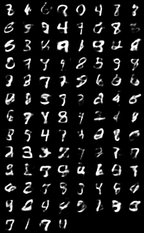
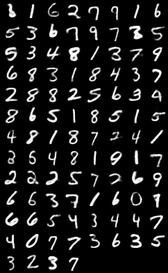

# Code for the paper ``On the Effectiveness of Two-Step Learning for Latent-Variable Models``. 

## Requirements
* Python >= 3.x  
* Numpy >= 1.16.0
* Pytorch >= 1.0.0 
* scikit-learn >= 0.20.2
* hmm-learn >= 0.2.2
* visdom >= 0.1.8 (for visualizations)  -- in all experiments you need to specify a link for your visdom server (https://github.com/facebookresearch/visdom) 
* librosa >= 0.6.3 (for the hmm experiment) 

## Synthetic data experiment

The code for figure 4 is in the script `toydata_exps.py`.  

## MNIST GMM-VAE experiment 

The code for the traces in Figure 5 is is in `mnist_exps.py`. 

## Celeba GMM-VAE experiment

The code for the traces in Figure 7 is in `celeba_exps.py`.

## Audio experiment 

The code for the audio results is in `test_audio_all.py`

## Training a prior for GAN

The code for this is in `wganpt/GAN_autoencoder_v2.py`. 

## Training a GAN prior for VAE

The code this is in `wganpt/gan_train_forvae.py`. 

Generated images for a given VAE

Generated images after we learn a GAN on the latent space of the VAE

